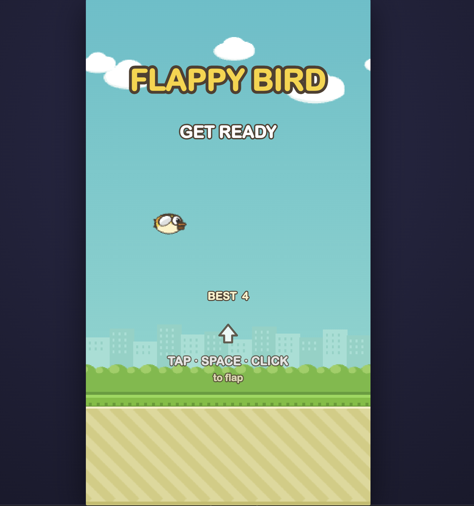

# Flappy Bird

An authentic Flappy Bird clone built with **TypeScript** and **Vite**, rendered
on a single HTML5 `<canvas>`. It ships with **zero external assets** — every
sprite is drawn programmatically at the game's native resolution, and all sound
effects are synthesized live with the Web Audio API.

Tap, click, or press a key to flap the bird through the gaps between pipes.
Clear as many as you can, earn medals, and beat your best score.



## Features

- **Faithful recreation** at the original 288×512 logical resolution, with
  crisp, chunky pixel scaling to fit any viewport.
- **Procedurally generated art** — the bird (with a 3-frame wing flap), pipes,
  scrolling ground, and a parallax background (sky, clouds, city skyline, and
  bushes) are all rendered to offscreen canvases at runtime. No image files.
- **Synthesized sound** — flap, score, hit, and die effects are generated with
  the Web Audio API. No audio files, and it degrades gracefully when audio is
  unavailable.
- **Delta-time game loop** so the simulation runs at a consistent speed
  regardless of the display's refresh rate.
- **Signature physics** — gravity plus a flap impulse, terminal fall speed, and
  a velocity-driven "flap-up, nose-dive" rotation. The collision hitbox is
  slightly inset for a forgiving, near-miss feel.
- **Scoring and medals** — earn bronze (10), silver (20), gold (30), or platinum
  (40) on the game-over scoreboard.
- **Persistent best score** saved to `localStorage`, with a "NEW" badge when you
  set a record.
- **Responsive** across desktop and mobile, with `devicePixelRatio` awareness
  and touch scrolling/zoom disabled so taps only ever flap.
- **Headless test suite** covering the core game logic — no browser required.

## Controls

| Action | Input |
| --- | --- |
| Flap | Tap / Click / `Space` / `↑` / `W` |
| Start a run | Any flap input from the "Get Ready" screen |
| Play again | Tap / Click / `Space` / `Enter` after game over |

A short cooldown (~0.55s) is applied after death before restart input is
accepted, so you don't accidentally skip the scoreboard.

## Getting Started

### Prerequisites

- [Node.js](https://nodejs.org/) 18+ (for Vite 5)
- npm

### Install

```bash
npm install
```

### Run the dev server

```bash
npm run dev
```

Vite will print a local URL (typically `http://localhost:5173`). Open it in your
browser to play.

### Build for production

```bash
npm run build
```

The optimized, static output is written to `dist/`. Because the build uses a
relative base path, it can be served from any static host or opened from a
subdirectory.

### Preview the production build

```bash
npm run preview
```

## Scripts

| Script | Description |
| --- | --- |
| `npm run dev` | Start the Vite development server with hot reload. |
| `npm run typecheck` | Type-check the project with `tsc --noEmit`. |
| `npm test` | Run the headless logic tests in Node via esbuild. |
| `npm run build` | Type-check, then produce a production build in `dist/`. |
| `npm run preview` | Serve the production build locally. |

## Testing

The game logic is verified headless in Node — no browser needed:

```bash
npm test
```

`test/dom-stub.ts` provides a minimal stub of the browser APIs the game touches
(canvas 2D context, `localStorage`, `requestAnimationFrame`, timing, etc.), and
`test/smoke.ts` exercises bird physics, pipe geometry, the state machine,
scoring, collisions, medal thresholds, and best-score persistence.

## Project Structure

```
.
├── index.html          # Entry point; hosts the #game canvas
├── vite.config.ts      # Vite config (relative base, dist output)
├── tsconfig.json       # Strict TypeScript configuration
├── src/
│   ├── main.ts         # Bootstraps the Game against the canvas
│   ├── game.ts         # Controller: loop, input, state machine, collision,
│   │                   #   scoring, HUD and overlays
│   ├── bird.ts         # Bird entity: physics, rotation, wing animation
│   ├── pipe.ts         # Pipe pair: scrolling and collision rectangles
│   ├── constants.ts    # Central config: dimensions, physics, colours, medals
│   ├── sprites.ts      # Procedural sprite generation + pixel-font numbers
│   ├── sound.ts        # Web Audio synthesized sound effects
│   └── style.css       # Page layout and crisp-pixel canvas styling
└── test/
    ├── smoke.ts        # Headless logic tests
    └── dom-stub.ts     # Minimal browser-environment stub for Node
```

## How It Works

The bird's horizontal position is fixed while the world scrolls past it. Each
frame, the game loop computes a delta-time factor (`1.0` == exactly 60 fps) and
feeds it to every update, keeping motion consistent across refresh rates.

The `Game` controller drives a simple finite state machine —
`ready → playing → gameover` — handling pointer and keyboard input, spawning
pipes at a fixed spacing with randomized gap centers, detecting collisions
against pipes and the ground, tracking the score, and drawing the world, HUD,
and overlays. All rendering targets the logical coordinate space and is scaled
up with image smoothing disabled for the classic pixel look.

## License

This is an educational clone of the original Flappy Bird game. All assets are
generated at runtime; no original artwork or audio is included.
